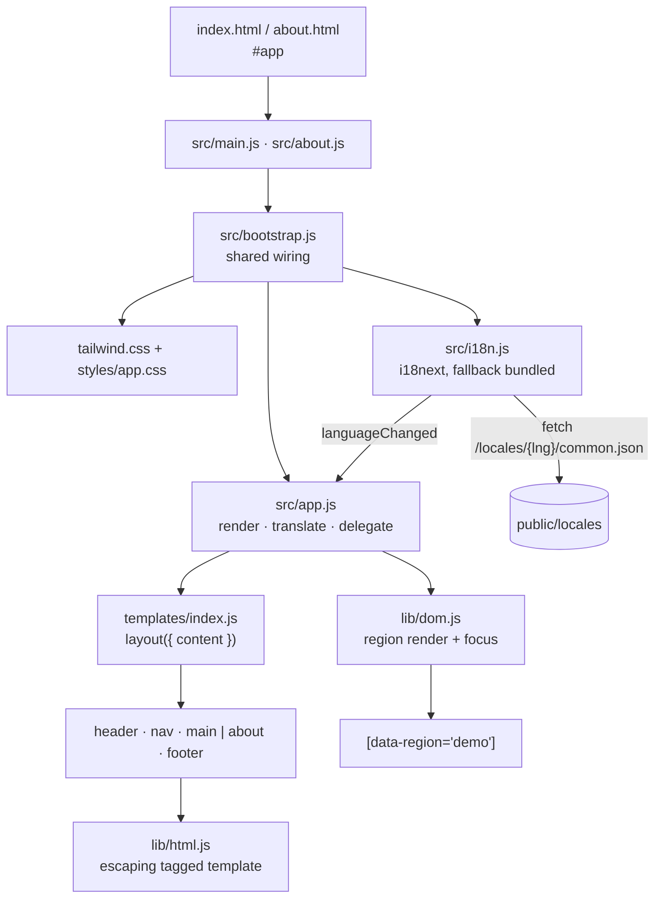
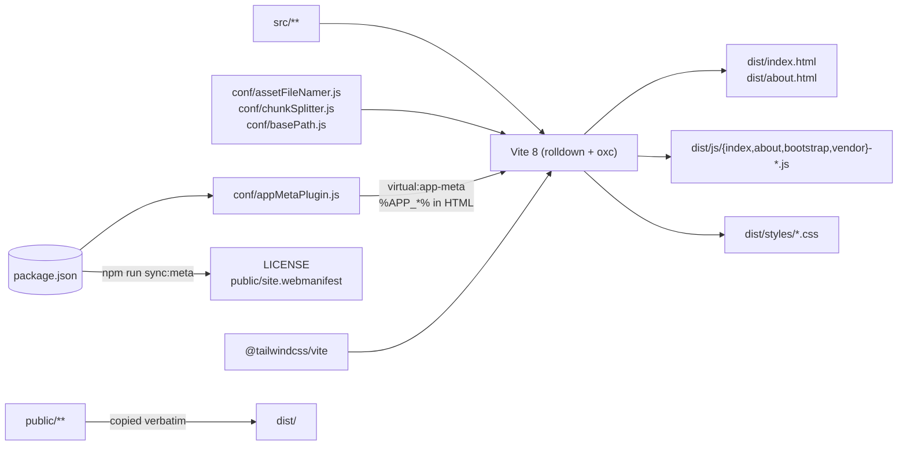

# Architecture

## Requirements

### Functional

- Render static pages from composable, testable template modules.
- Support more than one page without a client-side router.
- Keep a stateful region up to date without destroying focus or caret position.
- Translate pages at runtime and let the visitor switch language without a reload.
- Provide unit testing, linting, formatting, and type checking out of the box.

### Non-functional

| Concern         | Target                                                                   | How it is met                                                                                                                                    |
| --------------- | ------------------------------------------------------------------------ | ------------------------------------------------------------------------------------------------------------------------------------------------ |
| Bundle size     | < 200 kB uncompressed for the pages that ship                            | No framework, no icon packs, one vendor chunk ([ADR-0003](adr/0003-icons-and-flags-out-of-core.md), [ADR-0005](adr/0005-single-vendor-chunk.md)) |
| Security        | No `unsafe-eval`; no unescaped interpolation                             | Tagged-template escaping, `textContent` for translations ([ADR-0001](adr/0001-drop-handlebars-for-tagged-templates.md))                          |
| First paint     | Real text, not empty elements                                            | Fallback locale bundled ([ADR-0012](adr/0012-bundle-the-fallback-locale.md))                                                                     |
| Reproducibility | A build never mutates its input                                          | Autofix lives in hooks ([ADR-0006](adr/0006-quality-gates.md))                                                                                   |
| Accessibility   | Visible focus, honoured `prefers-reduced-motion`, focus survives updates | `src/styles/app.css`, `aria-current` on the switcher, `data-focus-key` ([ADR-0011](adr/0011-region-updates-not-a-renderer.md))                   |
| Maintainability | One configuration surface per concern                                    | CSS-first Tailwind ([ADR-0002](adr/0002-tailwind-v4-via-vite-plugin.md)), no preprocessor ([ADR-0009](adr/0009-drop-sass.md))                    |
| Forkability     | Project identity has exactly one home                                    | `package.json` feeds the bundle, the HTML, `LICENSE`, and the manifest ([ADR-0007](adr/0007-project-identity-from-package-json.md))              |
| Portability     | One build serves a domain root or a sub-path                             | `BASE_PATH` build input, `import.meta.env.BASE_URL` in templates ([ADR-0008](adr/0008-configurable-base-path-and-pages-deploy.md))               |

### Constraints

- Vanilla JavaScript — no framework, no compile step at the source level ([ADR-0004](adr/0004-type-checked-jsdoc.md)).
- Static hosting: no server, no build-time data fetching.
- Content-first sites. Many interdependent stateful views are explicitly out of scope
  ([ADR-0010](adr/0010-multi-page-by-default.md), [ADR-0011](adr/0011-region-updates-not-a-renderer.md)).

## Runtime structure

Each page is rendered once. Language changes never rebuild markup: `applyTranslations` rewrites
`textContent` for `[data-i18n]` elements and the attributes listed in `[data-i18n-attr]`, and
`markActiveLanguage` updates `aria-current`. State changes re-render one region and restore focus
around it. All interaction runs through delegated `click` and `input` listeners on the root, so no
handler is ever rebound.

## Build structure

## Failure modes

| Failure                                      | Behaviour                                   | Mitigation                                                                                     |
| -------------------------------------------- | ------------------------------------------- | ---------------------------------------------------------------------------------------------- |
| `#app` missing from an HTML entry            | The entry throws immediately                | Explicit `throw` naming the cause, instead of a silent `console.error`                         |
| A locale file 404s                           | i18next falls back to the bundled `en`      | `fallbackLng`, `supportedLngs`, `load: 'languageOnly'`, and bundled fallback resources         |
| A translation contains markup                | Rendered as literal text                    | Translations are written with `textContent`, never `innerHTML` (covered by a test)             |
| A template interpolates user input           | Escaped                                     | `html` escapes by default; bypassing it requires an explicit `raw()`                           |
| A region re-renders while a field is focused | Focus and caret are restored                | `withPreservedFocus` + `data-focus-key` (covered by tests)                                     |
| A stale element reference is reused          | Silent no-op on the detached node           | Documented; the demo re-queries after every update                                             |
| A dependency bloats the bundle               | Build warns above 500 kB per chunk          | `npm run analyze` produces a treemap at `dist/stats.html`                                      |
| `LICENSE` or the manifest is edited by hand  | They drift from `package.json`              | `npm run sync:meta:check` fails the gate locally and in CI                                     |
| `package.json` has no `repository`           | Footer link would be empty                  | `normalizeRepositoryUrl` returns `''` and the footer omits the link                            |
| App served from a sub-path                   | Root-absolute asset URLs would 404          | `%APP_BASE%` in HTML, `import.meta.env.BASE_URL` in templates, self-relative manifest paths    |
| Link preview requested by a crawler          | Relative image URLs are ignored by crawlers | `%APP_URL%` resolves to an absolute URL when `SITE_URL` is set, which the deploy workflow does |

## Risks

| Risk                                                                                     | Impact                                | Mitigation                                                                  |
| ---------------------------------------------------------------------------------------- | ------------------------------------- | --------------------------------------------------------------------------- |
| `raw()` used on untrusted input                                                          | XSS                                   | Single call site to audit; documented in `src/lib/html.js` and ADR-0001     |
| A project outgrows region re-rendering                                                   | Jank, lost DOM state, ad-hoc renderer | ADR-0011 states the boundary; the README documents the lit-html swap        |
| Pinned to a fast-moving toolchain (Vite 8 / rolldown, Vitest 4, ESLint 10, TypeScript 7) | Breaking changes on upgrade           | Caret ranges, CI on Node 22 and 24, and the full gate on every change       |
| Rollup-era plugins assumed to work under rolldown                                        | Build breaks on a plugin upgrade      | Only two build plugins are used, both first-party or rolldown-aware         |
| Tailwind v4 CSS-first config is newer than most examples online                          | Confusion when copying v3 snippets    | ADR-0002 states the decision; `@theme` usage is shown in `src/tailwind.css` |
