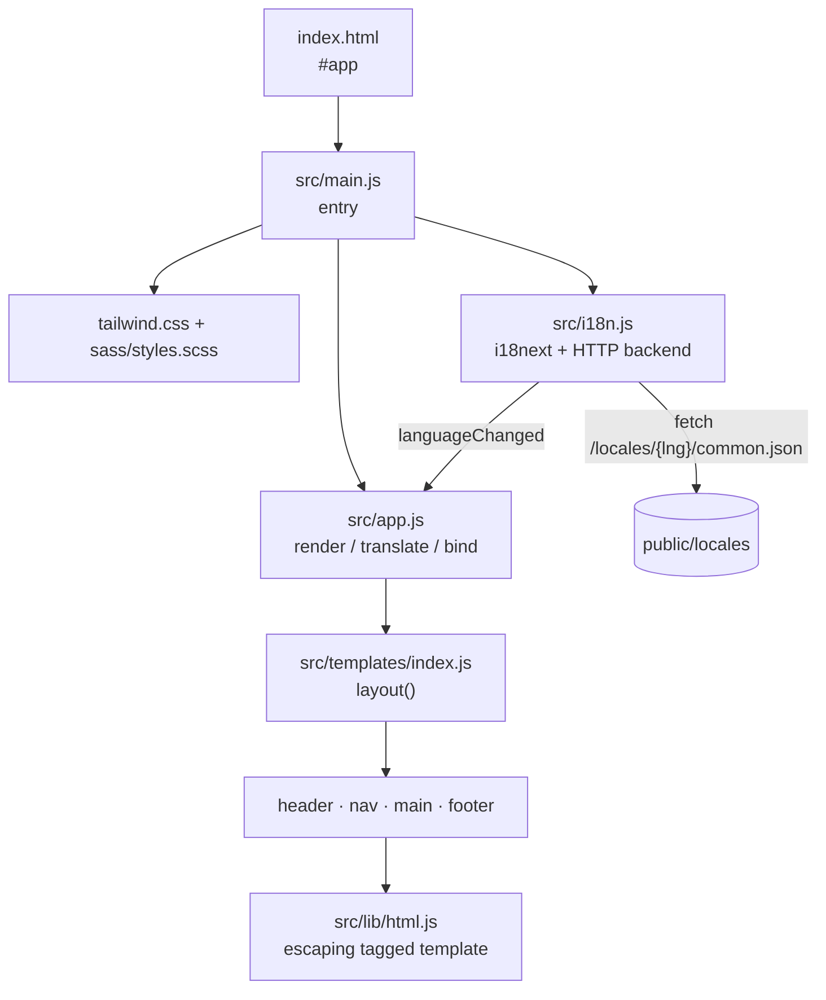
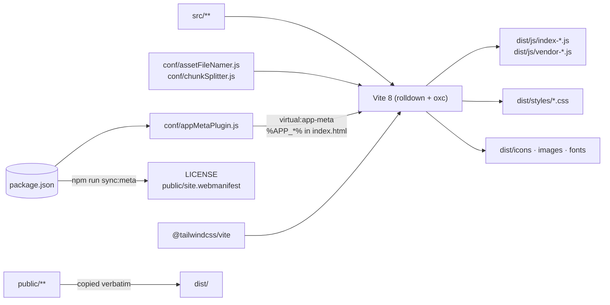

# Architecture

## Requirements

### Functional

- Render a static page from composable, testable template modules.
- Translate the page at runtime and let the visitor switch language without a reload.
- Provide a styling pipeline that combines utility classes with a small global stylesheet.
- Provide unit testing, linting, formatting, and type checking out of the box.

### Non-functional

| Concern         | Target                                                                   | How it is met                                                                                                                                        |
| --------------- | ------------------------------------------------------------------------ | ---------------------------------------------------------------------------------------------------------------------------------------------------- |
| Bundle size     | < 150 kB uncompressed for the starting page                              | No framework, no icon packs, one vendor chunk (see [ADR-0003](adr/0003-icons-and-flags-out-of-core.md), [ADR-0005](adr/0005-single-vendor-chunk.md)) |
| Security        | No `unsafe-eval`; no unescaped interpolation by default                  | Tagged-template escaping, `textContent` for translations ([ADR-0001](adr/0001-drop-handlebars-for-tagged-templates.md))                              |
| Reproducibility | A build never mutates its input                                          | Autofix moved into hooks ([ADR-0006](adr/0006-quality-gates.md))                                                                                     |
| Accessibility   | Visible focus, honoured `prefers-reduced-motion`, state exposed via ARIA | `src/sass/_app.scss`, `aria-current` on the language switcher                                                                                        |
| Maintainability | One configuration surface per concern                                    | CSS-first Tailwind ([ADR-0002](adr/0002-tailwind-v4-via-vite-plugin.md)), separate Vite and Vitest configs                                           |
| Forkability     | Project identity has exactly one home                                    | `package.json` feeds the bundle, `index.html`, `LICENSE`, and the manifest ([ADR-0007](adr/0007-project-identity-from-package-json.md))              |

### Constraints

- Vanilla JavaScript — no framework, no compile step at the source level ([ADR-0004](adr/0004-type-checked-jsdoc.md)).
- Static hosting: no server, no build-time data fetching.

## Runtime structure

The page is rendered once. Language changes never re-render markup: `applyTranslations` rewrites
`textContent` for `[data-i18n]` elements and attributes listed in `[data-i18n-attr]`, and
`markActiveLanguage` updates `aria-current`. All interaction runs through one delegated `click`
listener, so no handler has to be rebound.

## Build structure

## Failure modes

| Failure                                     | Behaviour                                                         | Mitigation                                                                             |
| ------------------------------------------- | ----------------------------------------------------------------- | -------------------------------------------------------------------------------------- |
| `#app` missing from `index.html`            | Entry throws immediately                                          | Explicit `throw` with a message naming the file, instead of a silent `console.error`   |
| A locale file 404s                          | i18next falls back to `en`; missing keys render as the key string | `fallbackLng`, `supportedLngs`, and `load: 'languageOnly'` so `en-GB` resolves to `en` |
| A translation contains markup               | Rendered as literal text                                          | Translations are written with `textContent`, never `innerHTML` (covered by a test)     |
| A template interpolates user input          | Escaped                                                           | `html` escapes by default; bypassing it requires an explicit `raw()`                   |
| A dependency bloats the bundle              | Build warns above 500 kB per chunk                                | `npm run analyze` produces a treemap at `dist/stats.html`                              |
| `LICENSE` or the manifest is edited by hand | They drift from `package.json`                                    | `npm run sync:meta:check` fails the gate locally and in CI                             |
| `package.json` has no `repository`          | Footer link would be empty                                        | `normalizeRepositoryUrl` returns `''` and the footer omits the link                    |

## Risks

| Risk                                                            | Impact                             | Mitigation                                                                           |
| --------------------------------------------------------------- | ---------------------------------- | ------------------------------------------------------------------------------------ |
| `raw()` used on untrusted input                                 | XSS                                | Single call site to audit; documented in `src/lib/html.js` and ADR-0001              |
| Full re-render on future stateful features                      | Lost DOM state, lost focus         | Keep rendering to one pass; add targeted updates rather than re-rendering the layout |
| Tailwind v4 CSS-first config is newer than most examples online | Confusion when copying v3 snippets | ADR-0002 states the decision; `@theme` usage is shown in `src/tailwind.css`          |
| Pinned to a fast-moving toolchain (Vite 8, Vitest 4, ESLint 10) | Breaking changes on upgrade        | Ranges are caret-pinned, CI runs the full gate on every change                       |
